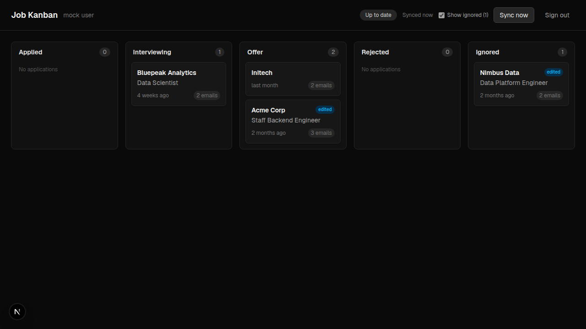

# Job Kanban

A single-user web app that reads your Gmail, detects job-application emails
(applied / interviewing / offer / rejected), and shows them as a kanban board
that keeps itself up to date. You correct anything it gets wrong.



## What it does

- Signs in with Google (Gmail read-only scope, one allowed email address).
- Polls Gmail every 2 minutes (and on demand via "Sync now") for new mail
  matching a job-related keyword prefilter.
- Classifies each email with Claude Haiku (falls back to a regex/keyword
  heuristic if no API key is set) to extract company, role, and status.
- Groups emails into one card per company; you can drag cards between
  columns, edit company/role/status/notes, mark something "not job-related",
  or delete it.

## Quick start

### Mock mode (no credentials needed)

```bash
npm install
npm run dev:mock
```

Open http://localhost:3000. Mock mode skips Google sign-in (fakes a session)
and reads from `src/mock/emails.json` instead of Gmail, so you can try the
whole app — board, drag-and-drop, edit, ignore, sync — with zero setup.
`ALLOWED_EMAIL` and `AUTH_SECRET` are optional in this mode.

### Real mode (your Gmail)

1. **Google Cloud project** (needs Arshita's own Google account):
   - Enable the Gmail API.
   - Create an OAuth 2.0 **Web application** client.
   - Add authorized redirect URI: `http://localhost:3000/api/auth/callback/google`.
   - Add her Gmail address as a test user (app stays in "Testing" mode — no
     Google verification needed for personal use).
2. Copy `.env.example` to `.env.local` and fill in:
   - `GOOGLE_CLIENT_ID` / `GOOGLE_CLIENT_SECRET` from the OAuth client above.
   - `ALLOWED_EMAIL=arshitamisraco@gmail.com` — only this address may sign in.
   - `AUTH_SECRET` — generate with `npx auth secret` or `openssl rand -base64 32`.
   - `ANTHROPIC_API_KEY` — optional; without it, classification uses the
     built-in heuristic instead of Claude.
3. `npm run dev`, open http://localhost:3000, sign in with Google.

## Architecture

```
 Browser (React board, drag-and-drop)
      │  fetch /api/*
      ▼
 Next.js API routes  ──────►  Gmail API (metadata + snippet, body fetched
 (auth, sync, CRUD)            transiently for classification only)
      │        │
      │        └────────────►  Claude Haiku (classification tool call)
      │                         falls back to a heuristic classifier
      ▼
 SQLite (./data/app.db, gitignored)
```

- Next.js 16 App Router, one repo for frontend + API routes.
- Auth: next-auth v5 (Auth.js), Google provider, JWT sessions holding the
  Google access/refresh tokens (no user DB — single user only).
- DB: `better-sqlite3`, no ORM, schema created at startup.
- Client polls `/api/sync` every 2 minutes and after manual "Sync now";
  re-fetches `/api/applications` after each sync. No websockets, no cron.

## What is stored

Only what's needed to show the board — **never full email bodies**:

- Subject, sender, received date.
- Gmail's own snippet, truncated to 200 characters.
- The classifier's output (is this job-related, status, extracted company/role).
- A `gmail_link` back to the message in Gmail (opens the real email there).

Email bodies are fetched transiently (server memory only) to feed the
classifier and are truncated to 2000 characters before that call; they are
never written to the database.

## How the work was split across sessions

This was built by a small "session network" of Claude agents sharing one
document, `PROJECT.md`, as the single source of truth:

1. A lead planner (on Fable) wrote `PROJECT.md` — the stack decisions, data
   model, API contract, and file ownership — and scaffolded the repo.
2. Two Sonnet coding sessions built the backend (`src/lib`, `src/app/api`,
   `src/mock`) and frontend (`src/app/page.tsx`, `layout.tsx`,
   `src/components`) in parallel, each reading only the contract in
   `PROJECT.md`, without seeing each other's code.
3. A Sonnet integration session (this one) ran the two halves together for
   the first time: fixed the build, exercised the app end-to-end in mock
   mode with Playwright, fixed the seams it found, and wrote this README.
4. An Opus reviewer does a short security pass after integration.

## Key trade-offs made for speed

- **Polling instead of Gmail push (Pub/Sub).** Push needs a public HTTPS
  endpoint plus a GCP topic — not worth it for a take-home; polling every
  2 minutes is good enough for one user.
- **SQLite with no ORM.** Single user, zero infrastructure, one file.
- **JWT sessions holding the Google tokens.** No user table needed.
- **Claude Haiku for classification, with a heuristic fallback.** Cheap and
  fast; the app never hard-depends on an API key.
- **Bodies fetched transiently, only for classification.** Only a 200-char
  snippet and subject are ever persisted.

## Needs Arshita / next steps

- [ ] Create the Google Cloud OAuth client (Gmail API enabled, redirect URI
      `http://localhost:3000/api/auth/callback/google`, her Gmail added as a
      test user) and put `GOOGLE_CLIENT_ID` / `GOOGLE_CLIENT_SECRET` in
      `.env.local`.
- [ ] Optional: `ANTHROPIC_API_KEY` for LLM-based classification (heuristic
      fallback works without it).
- [ ] `AUTH_SECRET` and `ALLOWED_EMAIL=arshitamisraco@gmail.com` in
      `.env.local`.
- [ ] Decide whether to keep the 90-day initial Gmail lookback (default;
      override with `INITIAL_LOOKBACK_DAYS`).

## Known limitations

- Without `ANTHROPIC_API_KEY`, classification is a regex/keyword heuristic —
  reasonable on clean ATS emails (Greenhouse/Lever/Workday/etc.) but weaker
  on unusual phrasing or company names.
- Freshness is bounded by the 2-minute poll interval, not real-time.
- Single user by design (`ALLOWED_EMAIL` gate, JWT session, no user table).
- SQLite is a single file (`./data/app.db`) with no separate backup or
  migration tooling — fine for one user, not for concurrent multi-instance
  deploys.
